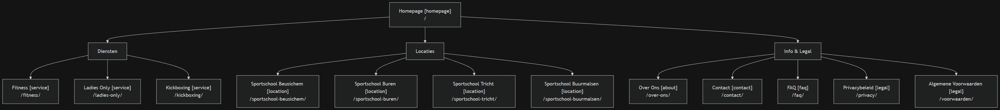
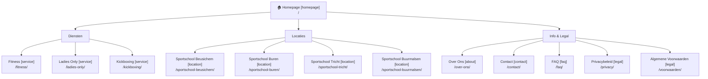

# SITEMAP-DRAFT.md
# FitCity Culemborg — Page Inventory
# Generated: 2026-04-04 | Approve before Session 3 build begins

---

## Constraints Applied (from Step 1 answers)

- Existing site: single-page, no sub-pages — no redirect constraints beyond homepage
- Blog: **out of scope** (Phase 2 if needed)
- Sociaal domein / zorg / gezondheidscentrum angle: **dropped** — focus is gym only
- Ladies Only: **standalone service page** (not just a homepage section)
- FAQ: **standalone page** (not accordion-only)
- Service areas: all 5 cities confirmed — Culemborg (= homepage target), Beusichem, Buren, Tricht, Buurmalsen
- Location-service cross-pages: **not in scope** — 3 services × 4 surrounding cities = 12 cross-pages; overkill for this market
- Kickboxing accent color: **TBD** — may shift from `#FF5722` to `#FFE303` (primary yellow); does not affect sitemap

---

## Page Inventory

| # | Page (NL) | Type | URL | Old URL | Status | Priority |
|---|---|---|---|---|---|---|
| 1 | Homepage | homepage | `/` | `/` | keep-exact | P0 |
| 2 | Fitness | service | `/fitness/` | — | new | P0 |
| 3 | Ladies Only | service | `/ladies-only/` | — | new | P0 |
| 4 | Kickboxing | service | `/kickboxing/` | — | new | P0 |
| 5 | Over Ons | about | `/over-ons/` | — | new | P0 |
| 6 | Contact | contact | `/contact/` | — | new | P0 |
| 7 | FAQ | faq | `/faq/` | — | new | P1 |
| 8 | Sportschool Beusichem | location | `/sportschool-beusichem/` | — | new | P1 |
| 9 | Sportschool Buren | location | `/sportschool-buren/` | — | new | P1 |
| 10 | Sportschool Tricht | location | `/sportschool-tricht/` | — | new | P1 |
| 11 | Sportschool Buurmalsen | location | `/sportschool-buurmalsen/` | — | new | P1 |
| 12 | Privacybeleid | legal | `/privacy/` | — | new | P1 |
| 13 | Algemene Voorwaarden | legal | `/voorwaarden/` | — | new | P1 |

**Total: 13 pages** | P0: 6 pages (launch day) | P1: 7 pages (within 2 weeks)

---

## SEO Notes per URL

- `/` — targets: "sportschool culemborg", "fitness culemborg", "gym culemborg"
- `/fitness/` — targets: "fitnesstraining culemborg", "fitnessruimte culemborg"
- `/ladies-only/` — targets: "ladies only sportschool", "vrouwen sportschool culemborg"
- `/kickboxing/` — targets: "kickboksen culemborg", "kickboxing lessen culemborg"
- `/over-ons/` — brand/trust page; secondary SEO value
- `/contact/` — targets: "sportschool culemborg contact", "openingstijden fitcity"
- `/faq/` — targets: long-tail questions ("wat kost een sportschool culemborg", "kan ik gratis proeftraining")
- `/sportschool-beusichem/` — targets: "sportschool beusichem", "fitness beusichem"
- `/sportschool-buren/` — targets: "sportschool buren", "fitness buren gelderland"
- `/sportschool-tricht/` — targets: "sportschool tricht", "fitness tricht"
- `/sportschool-buurmalsen/` — targets: "sportschool buurmalsen", "fitness buurmalsen"
- `/privacy/` + `/voorwaarden/` — legal only; no SEO value targeted

---

## Page Types Requiring Reference HTML

Generated in Prompt 4b (one HTML per unique page type, not per page):

- [x] homepage — `homepage-reference.html` (2,077 lines)
- [x] service — `service-page-reference.html` (1,164 lines) — covers `/fitness/`, `/ladies-only/`, `/kickboxing/`
- [x] location — `location-page-reference.html` (1,076 lines) — covers all `/sportschool-[stad]/` pages
- [x] about + contact — `about-contact-reference.html` (1,244 lines) — combined reference
- [x] faq — `faq-page-reference.html` (968 lines)

Legal pages (`/privacy/`, `/voorwaarden/`) — no reference HTML needed; plain text layout.

---

## Redirect Map

| Old URL | New URL | Status Code | Reason |
|---|---|---|---|
| `http://fitcityculemborg.nl/` | `https://fitcityculemborg.nl/` | 301 | HTTP → HTTPS (handled automatically by Cloudflare Pages) |

No other redirects required. Existing site has no sub-pages.

---

## Sitemap Diagram

---

## Decision Log

| Decision | Rationale |
|---|---|
| No Culemborg location page | Homepage already targets "sportschool culemborg" — a separate `/sportschool-culemborg/` would cannibalize |
| No service-category page | Only 3 services — homepage Pattern C cards cover discovery, no overview page needed |
| No location-service cross-pages | 3 × 4 = 12 extra pages; low competitive pressure in Culemborg market doesn't justify the content investment |
| Blog out of scope | Phase 2; add when client is ready to produce content consistently |
| Ladies Only standalone page | Female audience is a discrete target segment with different copy, trust signals, and search intent |
| Flat location URLs (`/sportschool-[stad]/`) | Directly match search queries like "sportschool beusichem" — better SEO than nested `/werkgebied/` structure for a gym |

---

## STATUS: Awaiting approval before Session 3 build begins
